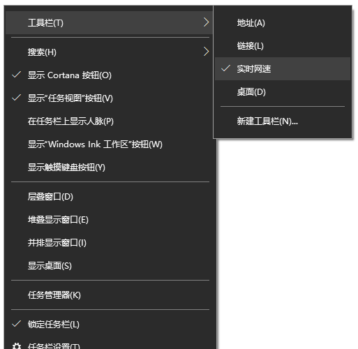

# NetSpeed
系统任务栏实时网速显示工具

## 截图


## 下载

[前往Releases](https://github.com/zou-z/NetSpeed/releases)下载最新版本的NetSpeed压缩包文件，并解压。

压缩包中包含以下3个文件：

| 文件          | 说明         |
| ------------- | ------------ |
| install.cmd   | 程序安装文件 |
| NetSpeed.dll  | 程序dll文件  |
| uninstall.cmd | 程序卸载文件 |

## 使用方法

### 安装

安装与卸载

1. 将解压出来的三个文件存放在硬盘中合适的位置（例如一个专门存放软件的文件夹下）。
2. 以`管理员身份`运行install.cmd文件。

### 卸载

1. 以`管理员身份`运行uninstall.cmd文件。

### 程序的运行与关闭

鼠标`右键`点击系统任务栏，点击第一项工具栏，选中实时网速。用同样的方法可关闭程序。



## 作为用户控件

本程序可作为用户控件使用，具体步骤如下：

1. 在项目的引用(.Net Framework项目)或依赖(.Net Core或.Net5项目)中添加压缩包中的dll文件。

2. 在xaml中添加ContentControl标签：

   ```xml
   <ContentControl x:Name="contentControl"/>
   ```

3. 实例化并在ContentControl中显示：

   ```csharp
   NetSpeed.Module.MainView mainView = new NetSpeed.Module.MainView();
   contentControl.Content = mainView;
   ```

   


