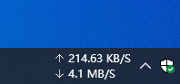

# NetSpeed

系统任务栏实时网速显示工具

## 截图

## 下载

[前往Releases](https://github.com/zou-z/NetSpeed/releases)下载最新版本的NetSpeed压缩包文件，并解压。

压缩包中包含以下3个文件：

| 文件          | 说明         |
| ------------- | ------------ |
| install.cmd   | 程序安装文件 |
| NetSpeed.dll  | 程序dll文件  |
| uninstall.cmd | 程序卸载文件 |

运行之后在同一个文件夹内会生成一个用于保存设置的NetSpeed.json文件。

## 使用方法

### 安装

安装与卸载

1. 将解压出来的三个文件存放在硬盘中合适的位置（例如一个专门存放软件的文件夹下）。
2. 以`管理员身份`运行install.cmd文件。

在卸载旧版后需要重启文件管理器（任务管理器中叫：Windows 资源管理器），然后安装新版

### 卸载

1. 关闭程序后，以`管理员身份`运行uninstall.cmd文件。

### 程序的运行与关闭

鼠标`右键`点击系统任务栏，点击第一项工具栏，选中实时网速。用同样的方法可关闭程序。

## 备注

* 如果注册了dll，那么在重新生成项目之前或是删除dll文件之前，需要在任务管理器中重启文件管理器(explorer)，因为它会占用dll文件。

* 注册命令中`/codebase`参数不可缺少（否则无法运行）。与没有此参数的命令的执行结果相比注册表中会多一个记录dll路径的codebase项。

## 常见问题

* 卸载旧版后再安装新版，为什么启动后还是旧版？

  文件管理器(explorer)缓存了程序的dll文件，卸载旧版后需要重启下电脑，然后安装新版本。

* 下载Releases的网速为什么这么慢？
  
  解决办法：（1）使用IDM、迅雷等支持多线下载的软件进行下载。（2）打开你的VPN，然后进行下载
  
  

